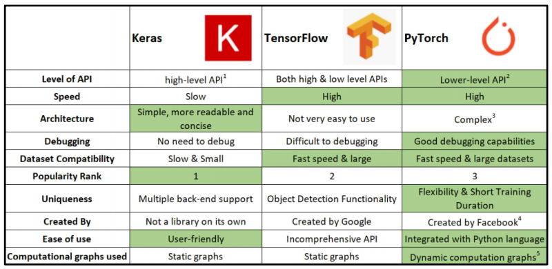

# 6일차 학습 정리
<h3 data-toc-skip> PyTorch 소개 </h3>

- **딥러닝 프레임워크**
  - **Tensorflow**, **PyTorch**, CNTK, mxnet, Caffe 등등
  - keras / TensorFlow / PyTorch
    - 
- **Computational Graph**
  - 연산의 과정을 그래프로 표현
  - Tensorflow
    - Define and Run    
    - 그래프를 먼저 정의 => 실행시점에 데이터 feed
    - production과 scalability의 장점
  - PyTorch
    - Define by Run (Dynamic Computational Graph, DCG)
    - 실행을 하면서 그래프를 생성하는 방식
    - 즉시 확인 가능 => pythonic code
    - 사용하기 편한 장점
- **PyTorch**
  - Numpy + AutoGrad + Function
  - Numpy구조를 가지는 Tensor객체로 array 표현
  - 자동미분 지원
  - 다양한 형태의 DL 함수, 모델 지원 (dataset, Multi-GPU 등등)

<h3 data-toc-skip> PyTorch basics </h3>

- Tensor
  - 다차원 Arrays를 표현하는 PyTorch 클래스
  - Numpy의 ndarray와 동일 == Tensorflow의 tensor와 동일
  - 차이는 GPU를 쓸 수 있게 해줌
  - Tensor handling & operations
    - reshape => view
    - squeeze, unsqueeze
    - 행렬곱셈 연산은 mm(broadcasting 미지원), matmul(broadcasting 지원)
    - 벡터 곱은 dot
    - DL/ML formula
      - 많은걸 지원해줌, 찾아보기
- AutoGrad
  - PyTorch의 핵심
  - backward 함수 사용

<h3 data-toc-skip> PyTorch 프로젝트 구조 </h3>

- 다양한 프로젝트 템플릿
  - 실행, 데이터, 모델, 설정, 로깅, 지표, 유틸리티 등
  - 다양한 모듈들을 분리하여 프로젝트 템플릿화
- (ngrok)
  - 서버화

<h3 data-toc-skip> AutoGrad & Optimizer </h3>

- nn.Module
  - 딥러닝을 구성하는 Layer의 base class
  - input, output, Forward, Backward, parameter(tensor) 정의
- nn.Parameter
  - Tensor 객체의 상속 객체
  - nn.Module 내에 attribute가 될 때는 required_grad=True로 AutoGrad의 대상이됨
- Backward
  - Layer에 있는 Parameter들의 미분을 수행
  - Forward의 결과값 (model의 ouput=예측치)과 실제값간의 차이(loss)에 대해 미분 수행
  
<h3 data-toc-skip> PyTorch Dataset </h3>

- Dataset
  - 데이터 입력 형태(Image, Text, Audio 등 표준화)를 정의하는 클래스
    - 데이터 형태에 따라 각 함수를 다르게 정의
  - 최근에는 HuggingFace 등 표준화된 라이브러리 사용
  - \_\_getitem\_\_()
    - map-style
    - 데이터를 불러올 때 어떤식으로 반환할 지
- transforms
  - totensor
    - 데이터 셋을 전처리하는 부분과 tensor로 바꾸어주는 부분이 구분이 됌
- DataLoader
  - batch, shuffle
  - data의 Batch를 생성해주는 클래스
  - sampler, batch_sampler
    - 샘플의 인덱스를 정하는 기법
  - collate_fn
    - 데이터 정리할 때, 가변인자 padding 할 때 주로 사용

---

# 피어세션
- 주말에 각자 뭐했는지 특별한일 공유
- 당일 학습 게획을 세우고 얼마나 수행했는지 점검
- 과제 관련 어려운점 논의
- 팀 대회
  - 모델 형태 구상
  - 데이터 전처리 방법 논의
- [회의록](https://night-eustoma-5f3.notion.site/9-26-798bd961043b4838b05ff89af63c5734)
  
---
### 참고자료
- 부스트캠프 AI Tech 교육 자료