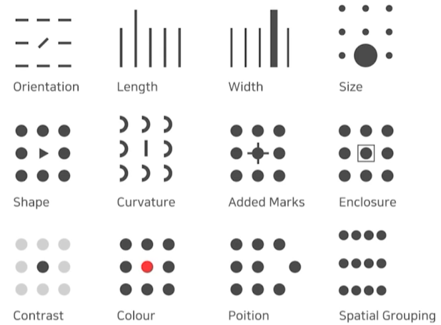

# 11일차 학습 정리

<h3 data-toc-skip> Historical Review </h3>

- 딥러닝의 중요한 요소
  - 데이터, 모델, 로스함수, 알고리즘
- 딥러닝의 역사
  - 2012년부터 지금까지의 트랜드

<h3 data-toc-skip> Neural Networks & Multi-Layer Perceptron </h3>

- Linear Neural Networks
  - $ y = W^T x + b $
- Beyond Linear Neural Networks
  - $ y = W_2^Th = W_2^T \rho(W_1^Tx) $
  - $ \rho = \text{Nonlinear transform} = \text{activation function}$
- Multi-Layer Perceptron
- Loss functions
  - Regression Task => MSE
  - Classificaion Task => CE
  - Probabilistic Task => MLE (=MSE)
- MLP 실습

<h3 data-toc-skip> Optimization </h3>

- **Generaization**
  - Generalization gap
    - 학습성능과 테스트성능의 차이
- **Cross-validation**
- **Bias and Variance**
  - Bias and Vanriance Tradeoff
    - 학습 데이터에 노이즈가 있을 때 bias, variance를 둘 다 줄이기 힘들고 하나가 줄어들면 하나는 커질 수 밖에 없다.
- **Bootstrapping**
  - 학습 데이터를 여러개로 나누고 학습 모델을 여러개 만들어 좋은 성능의 모델을 구축하는 기법 
  - Bagging(**B**ootstrapping **agg**regat**ing**)
    - 여러개의 모델을 만들고 결과를 통계내는 방법(앙상블)
  - Boosting
    - 간단한 모델을 만들고 예측이 잘 안되는 데이터에 대해 강한 모델을 또 만들어 강한 모델로 합치는 기법
  - 
- **Gradient Descent**
  - Batch-size Matters
    - 큰 배치사이즈 => Sharp Minimum
    - 작은 배치사이즈 => Flat Minimum
    - Flat Minimum에 도달하는게 더 나은 결과
  - SGD, Momentum, Nesterov accelerated gradient, Adagrad, Adadelta, RMSprop, Adam
- Parameter Norm Penalty
  - 함수를 부드러운 함수로 가정
- Noise Tobustness
  - inputs과 weights에 노이즈를 넣는 기법
- Label Smoothing
  - Mixup, CutMix, Cutout
- Batch Normalization
- **Optimizer 비교 실습**

<h3 data-toc-skip> CNN(Convolution Neural Networks) </h3>

- Convolution
  - Parameters 수 계산
  - Output 계산
- CNN
  - Convolution layer, Pooling layer, Fully connected layer
- Stride & Padding
- **Modern Convolutional Neural Networks**
  - ILSVRC 우승 기록 모델 위주
    - ImageNet Large-Scale Visual Recognition Challenge
  - AlexNet
    - 2012년 최초로 Deep Learning을 활용하여 우승
  - VGGNet
    - 3x3 convolution filters만 사용
      - Receptive field를 유지하며 파라미터 수를 줄임
  - GoogLeNet
    - Inception blocks
      - 1x1 convolution 활용
        - 채널을 줄이면서 파라미터 수를 줄임
  - ResNet
    - Skip connection
      - identity map 추가
      - layer를 깊게 쌓을 수 있도록 도움
    - Bottleneck 구조
  - DenseNet
    - Dense Block
      - 피처맵을 이어서 크게 만드는 역할
    - Tranition Block
      - Dense Block에서 크게만들어진 피처를 작게 만드는 역할

<h3 data-toc-skip> Computer Vision Applications </h3>

- Semantic Segmentation
  - Fully Convolutional Network
    - 큰 이미지에 대해 히트맵을 구할 수 있음
    - upsample
      - Deconvolution (conv transpose)
- Detection
  - R-CNN
    - region proposals 추출 -> warped region -> CNN
  - SPPNet
    - CNN을 한번만, 피처맵에서 패치 추출
  - Fast R-CNN
    - CNN 피처맵 생성 -> region, 피처맵을 ROI pooling -> class와 bounding-box 결과
  - Faster R-CNN
    - Region Proposal Network + Fast R-CNN
      - anchor boxes를 활용
  - YOLO
    - Region Proposal 과정없이 한번에
    - grid cell
    - 바운딩 박스를 찾는 것과 클래스 찾는 것을 동시에

<h3 data-toc-skip> 데이터 시각화 </h3>

- 데이터
  - 데이터셋 관점 (global), 개별 데이터의 관점 (local)
  - 데이터 셋 종류 : 정형, 시계열, 지리, 관계형, 계층적, 비정형 등
  - 데이터 종류
    - 수치형 : 연속형, 이산형
    - 범주형 : 명목형(ex. 혈액형, 종교 등), 순서형(ex. 학년, 별점, 등급 등)
- 시각화
  - 마크
    - 점, 선, 면으로 이루어진 데이터 시각화
  - 채널
    - 각 마크를 변경할 수 있는 요소들
  - 전주의적 속성(Pre-attentive Attribute)
    - 주의를 주지않아도 인지하게 되는 요소
    - 적절하게 사용할 때, 시각적 분리(visual pop-out)
    - 

---

# 기본과제
- Multilayer Perceptron (MLP)
  - MLP를 활용한 MNIST classification 구현
- Optimization
  - 회귀 문제를 이용하여 Optimizer 차이점 확인
- CNN
  - CNN 구조를 이용한 MNIST classification 구현

---

# 피어세션
- 모더레이터 시작
- 강의 진도를 팀끼리 맞추어 학습 내용 공유를 원활히 하고자 함
- 팀 대회 의견 공유
- [회의록](https://night-eustoma-5f3.notion.site/10-04-6f717744656c42dd942b8a16d3d2804b)

---

### 참고자료
- 부스트캠프 AI Tech 교육 자료