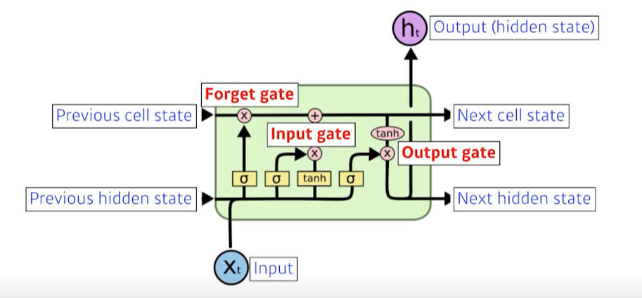

# 12일차 학습 정리

<h3 data-toc-skip> Recurrent Neural Networks </h3>

- **Sequential Model**
  - Sequential 데이터
    - 길이가 일정하지 않다
    - 과거의 정보량이 점점 늘어난다
  - Markov model(first-order auto regressive model)
    - 현재는 바로 전 과거 하나에만 의존
  - Laten autoregressive model
    - hidden state가 과거의 정보를 요약
- **RNN**
  - 단점 : Short-term dependencies
  - 시간이 지날수록 과거의 정보가 소실된다
    - vanishing/exploding gradient
- **LSTM (Long Short Term Memory)**
  - 
  - cell state
    - 컨베이너 벨트 처럼 과거 정보를 통과시킨다
  - Forget gate
    - 이전의 과거 중에 버릴 것들을 버린다
  - Input Gate
    - 들어온 정보 중에 올릴 것들을 정한다
  - Update cell
    - 버릴건 버리고 새로운 것들은 취합하여 넘긴다
  - Output Gate
    - Output을 정한다
- **GRU (Gate Recurrent Unit)**
  - 더 간단한 구조
    - 2개의 게이트 (reset gate, update gate)
    - hidden state

<h3 data-toc-skip> Transformer </h3>

- 시퀀스 데이터의 어려운점
  - Trimmed, Omitted, Permuted sequence
- 재귀적인 구조 없이 Attention 활용
- 입력 시퀀스의 길이, 도메인과 출력 시퀀스의 길이, 도메인이 다를 수 있다.
- Encoder와 Decoder 구조
  - Encoder
    - self-attention
      - 출력 벡터들을 만들 때 입력된 모든 단어를 고려함
      1. 각 단어 마다 Query, Key, Value 벡터를 만든다.
      2. 각 단어와 다른 단어의 Score를 구한다. (단어의 Query 벡터와 다른 단어 Key 벡터의 내적)
      단어와 다른 단어 사이의 관계, 상호작용 측정
      3. Score normalize
      4. Score와 Value 벡터의 가중치 합으로 최종 단어 벡터 추출
    - 하나의 encoder에는 하나의 attention head
    - 8개의 헤드를 이어서 linear과정을 통해 하나로 줄임 (Multi-Headed Attention)
    - positional encoding
      - 특정 값을 더한다
  - Decoder
    - 입력으로 들어오는 Query벡터와 Encoder로 만들어지는 key, value 벡터를 받는다
    - Encoder-Decoder Attention
- Vision Transformer
  - 사진을 나누고 밀어 마치 시퀀스처럼 입력으로 넣고 Transformer의 인코더만 사용하여 이미지 처리
- DALL-E
- 중요한 부분
  - 제대로 이해하지 못해 복습 필수!

<h3 data-toc-skip> Generative Models </h3>

- **Basic Discrete Distributions**
  - Bernoulli distribution : 이진
  - Categorical distribution : 다중 카테고리
  - ex. RGB 분포를 표현하기 위해 필요한 파라미터는 256 * 256 * 256 -1 만큼 필요
    - 너무 큼
- **Independence**
  - 바이너리 픽셀 이미지도 그 분포를 표현하려면 $ 2^n -1 $ 
  - Independence structure을 이용하면 $ n $으로 줄어든다
    - 하지만 표현력이 떨어진다
    - 즉, 유의미한 분포를 얻어내기 쉽지 않다
- **Conditional Independence**
  - Chain rule
    - $ p(x_1, ...,x_n) = p(x_1)p(x_2 \mid x_1)p(x_3 \mid x_1x_2) ··· p(x_n \mid x_1, ... , x_{n-1}) $
  - Bayes' rule
    - $ p(x \mid y) = \frac {p(x,y)}{p(y)} = \frac {p(y \mid x)p(x)}{p(y)}  $
  - Conditional independence
    - if, $ x \perp y \mid z $, then $ p(x \mid y,z) = p(x \mid z)$
    - Chain rule 에 접목 가능
      - 이때 필요한 파라미터는 $2n -1$
- **Autoregressive Model**
  - 순차적으로 되돌아와 적용되는 모델
  - NADE(Neural Autoregressive Density Estimator)
  - 요약
    - 샘플링이 매우 쉽다 but 생성이 느리다
    - 확률이 계산되는 명백한 모델이다, 또 확률 계산은 빠르다
    - Continuous한 값에 확장이 가능하다
- **Maximum Likelihood Learning**
  - 가능도를 높이는 방향으로 학습
  - Generative model을 풀 수 있는 쉬운 방법 중 하나
    - 학습하는 density와 가장 근사를 잘하는 density의 거리를 줄이는 방향
    - 확률 사이의 분포 근사 거리를 줄이는 방법
      - KL-diviergence
        - $ \mathbb{D} (P_{data} \mid \mid  P_{\theta}) = \mathbb{E}_{x \sim P_{data}}[log{P_{data}(x)}] - \mathbb{E}_{x \sim P_{data}}[log{P_{\theta}(x)}]$
        - KL-diviergence를 최소화한다는 것 == log-likelihood가 최대가 되는 것
        - $p_{data}$에 접근이 불가능 하여 Emprical log-likelihood로 근사
  - ERM(Emprical Risk Minimization)
    - 오버피팅이 흔하게 자주 일어난다
    - hypothesis space를 줄인다
  - Under-fittng이 심함
    - 모든 공간의 분포를 사용하지 못함
- **Laten Variable Models (VAE)**
  - Autoencoder != generative model
  - Variational Autoencoder
    - Variational inference
      - 찾고자하는 분포(Posterior distribution)가 너무 어려워 비슷한 분포(Variational distribution)로 근사하는 방법
      - Encoder => Variational distribution을 학습하는 것 => 즉, 목표

---

# 기본과제
- RNN
  - LSTM 구현
- Transformer
  - SDPA (Scaled Dop-Product Attention)과 MHA (Multi-Head Attention) 구현

---

# 멘토링
- 깃 사용 방법
- 최신 CV 트랜드 소개
- 팀 대회 관련 질문
  - 대분류, 중분류, 소분류 멀티 Loss 방식 고려

---

# 피어세션
- 수업 관련
  - Transformer 강의 부터 어려운 점이 많아 서로 이해한 만큼 공유
- 팀 대회
  - 각자 찾은 모델을 적용하여 성능 비교
  - 문제점 공유
  - 구글 드라이브와 깃허브를 활용하여 소스코드 공유
- [회의록](https://night-eustoma-5f3.notion.site/10-05-f4f3eb3641914b378ce10650e2e30cf1)

---

### 참고자료
- 부스트캠프 AI Tech 교육 자료